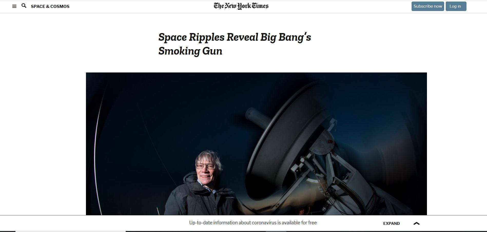

# Project: Positioning and Floating Elements

> In this project, we have collaborated to replicate the NYT article linked below in the Acknowledgments section.

This project is made to test our abilities in CSS and HTML regarding positioning
of elements.

## Built With

- HTML5, CSS3
- No frameworks are used in this project
- Stylelint.json

## Live Demo

[Live Demo Link](https://rawcdn.githack.com/Berabjesus/New-York-Times-article-page/ccdae333c0591d14d1d61f09d52c363e99b5b0d6/index.html)

## Authors

👤 **Bereket Beshane**

- Github: [@githubhandle](https://github.com/Berabjesus)
- Twitter: [@twitterhandle](https://twitter.com/bereket_ababu_b)
- Linkedin: [linkedin](https://www.linkedin.com/in/bereket-beshane-a1b75a1a9/)

👤 **José Francisco Silva Díaz**

- Github: [@SunnySparks](https://github.com/sunnySparks)
- Twitter: [@JosFranT6](https://twitter.com/josfrant6)
- Linkedin: [linkedin](https://www.linkedin.com/in/josé-francisco-silva-díaz-a2a9421a6)

## 🤝 Contributing

Contributions, issues, any kind of feedback and feature requests are welcome!

## Show your support

Give a ⭐️ if you like this project!

## Acknowledgments

- This website was really helpful for us to have a better understanding about CSS positioning
- All the styles were directly inspired from the [original website] (https://www.nytimes.com/2014/03/18/science/space/detection-of-waves-in-space-buttresses-landmark-theory-of-big-bang.html) 

## 📝 License

This project has no license
